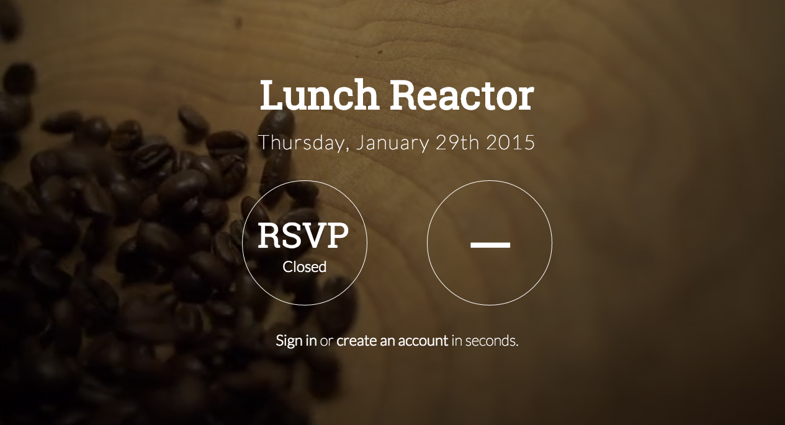
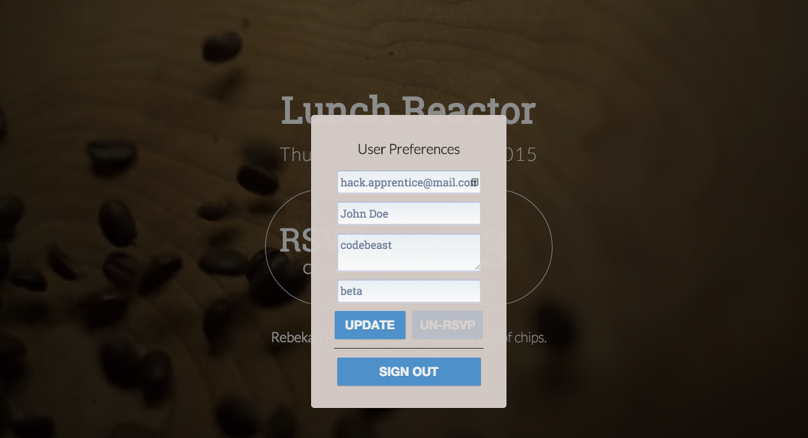

LunchReactor
============
##### [http://lunchreactor.parseapp.com](http://lunchreactor.parseapp.com)
*Currently supported in Chrome*

Want to get to know everyone in your Hack Reactor Cohort? Are you too shy to ask? Use the LunchReactor app to combinate a lunch with two of your peers.

#### What is LunchReactor? 

LunchReactor is a web applicaiton that randomly pairs up Hack Reactor Students for lunch in groups of three.

Rounds open 12:00am and close at 11:00am every weekday. Participants sign up before lunch and are notified via email with their lunch appointment.

#### I'm interested. How do I sign up?
1. Go to http://lunchreactor.parseapp.com
2. Click 'Create an Account' with the channel name **'beta'** or 'Sign In' if you have an account
3. Click on your username to open 'User Preferences'
4. If you didn't enter **'beta'** as your channel on sign up, update your channel name to **'beta'**. * **This is a must! Otherwise you won't be part of a group and might get lonely!** * (We'll roll out cohort channels in the next iteration)

## That's it! You're done! 
#### Wait for an email shortly after 11:00am and lunch on!

###### Now go mingle with your cohort

Credits: 
Danny Delott, Matt Brown, Tyler Julian, Dennis Yang